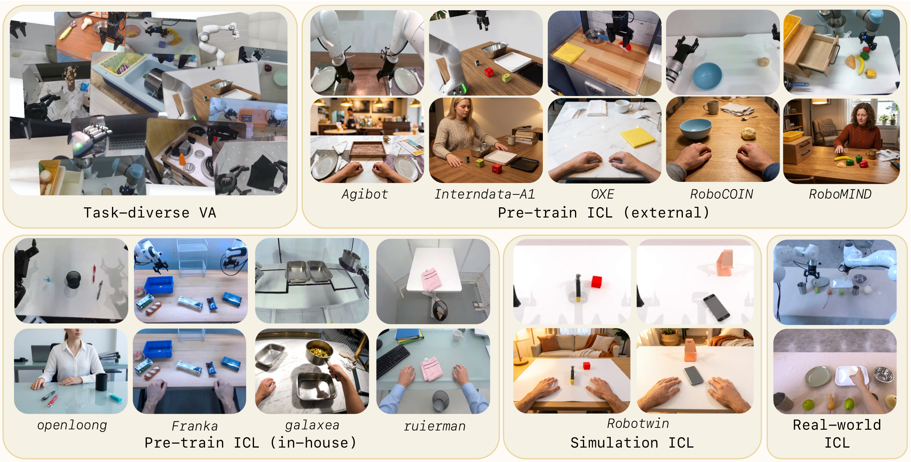
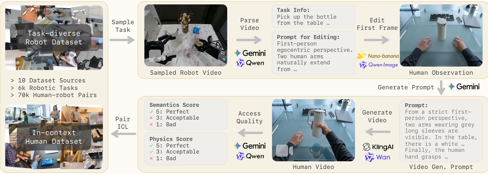

<h1 align="center">Zero-WAM:<br>In-Context World-Action Modeling from Human Videos for Open-Ended Task Generalization</h1>

<p align="center">
  <strong>
    <a href="https://jiaming-zhou.github.io/">Jiaming Zhou</a> &nbsp;
    <a href="https://zqh0253.github.io/">Qihang Zhang</a><sup>*</sup> &nbsp;
    <a href="https://gangweix.github.io/">Gangwei Xu</a> &nbsp;
    <a href="https://alfayoung.github.io/">Cunxin Fan</a> &nbsp;
    <a href="https://github.com/robbyant-research/Zero-WAM">Yujie Zhao</a> &nbsp;
    <a href="https://github.com/robbyant-research/Zero-WAM">Ruilin Wang</a> &nbsp;
    <a href="https://ymluo1214.github.io/">Yiming Luo</a> &nbsp;
    <a href="https://yangs03.github.io/">Shuai Yang</a> &nbsp;
    <a href="https://scholar.google.com/citations?user=Hnh87z4AAAAJ&hl=en">Xing Zhu</a> &nbsp;
    <a href="https://shenyujun.github.io/">Yujun Shen</a> &nbsp;
    <a href="https://junweiliang.me">Junwei Liang</a><sup>†</sup> &nbsp;
    <a href="https://justimyhxu.github.io/">Yinghao Xu</a><sup>†</sup>
  </strong>
  <br>
  Robbyant &nbsp;·&nbsp; HKUST (GZ) &nbsp;·&nbsp; HKUST
  <br>
  <sup>*</sup>Project Lead &nbsp;&nbsp; <sup>†</sup>Corresponding Authors
</p>

<p align="center">
  <a href="https://robbyant-research.github.io/Zero-WAM/"></a>
  <a href="https://arxiv.org/abs/2608.26103"></a>
  
  
  
  <a href="LICENSE"></a>
</p>

<p align="center">
  <a href="https://robbyant-research.github.io/Zero-WAM/">
    
  </a>
</p>

## Overview

Zero-WAM targets zero-shot cross-task robotic manipulation, where a policy must execute tasks that were never practiced during training using only deployment-time context. It brings in-context learning to robotics by treating human demonstration videos as visual task specifications, enabling a causal video-action policy to predict future robot observations and executable actions from either language instructions or human video prompts.

## Release Plan

- [x] Paper release: [arXiv:2608.26103](https://arxiv.org/abs/2608.26103)
- [ ] Code: expected before Sep 15, 2026
- [ ] Model: expected before Sep 15, 2026
- [ ] Data: expected before Sep 15, 2026

## Highlights

- We formulate zero-shot robotic task generalization as in-context world-action modeling, where one causal policy supports both language and human videos as task instructions.
- We introduce a scalable HumanGen pipeline that converts task-sampled robot trajectories into semantically matched human video instructions, yielding 74.2K human-robot ICL pairs over 8.6K tasks.
- We propose Zero-WAM with an in-context future chunk prediction objective to reduce shortcut learning and strengthen the use of human video prompts.
- We demonstrate zero-shot cross-task generalization in RoboTwin 2.0 and real-world unseen task configurations without collecting corresponding robot data or updating model parameters.

## Data Overview

Zero-WAM builds its training data around task diversity rather than raw trajectory count. Task-diverse VA re-samples five public robotic video-action datasets at the task level, yielding more than 6K manipulation tasks and about 400K robot trajectories per training epoch. HumanGen complements this robot-domain corpus with 74.2K human-robot ICL pairs over 8.6K tasks, spanning external, in-house, simulation, and real-world sources.

<p align="center">
  
</p>

## Data Pipeline

The in-context human video generation pipeline starts from task-sampled robot trajectories that retain executable actions. A VLM parses task semantics and object-state changes, an image editor converts the first robot frame into a human observation, and a video generation model synthesizes the corresponding human manipulation video. Each generated video is filtered for semantic preservation and physical plausibility before being paired back with the original robot trajectory as an ICL sample.

<p align="center">
  
</p>

## RoboTwin 2.0 Zero-Shot Evaluation

Zero-WAM achieves 46.95% average zero-shot success on seven unseen RoboTwin 2.0 tasks, outperforming LingBot-VA by 29.50 percentage points.

| Task | WAN-Action | LingBot-VA | **Zero-WAM** |
| --- | ---: | ---: | ---: |
| Place object on scale | 3.00 ± 2.16 | 6.17 ± 4.87 | **24.67 ± 2.05** |
| Stamp seal | 7.33 ± 1.25 | 3.67 ± 2.49 | **47.00 ± 4.55** |
| Open microwave | 2.26 ± 1.60 | 29.33 ± 10.66 | **59.00 ± 2.83** |
| Move stapler to pad | 10.67 ± 1.70 | 23.33 ± 8.22 | **69.14 ± 2.93** |
| Place bread in basket | 15.26 ± 2.55 | 17.33 ± 6.18 | **35.00 ± 3.74** |
| Place empty cup | 38.33 ± 2.05 | 42.33 ± 7.85 | **84.87 ± 0.18** |
| Stack blocks three | 0.00 ± 0.00 | 0.00 ± 0.00 | **9.00 ± 2.16** |
| **Average** | **10.98 ± 1.07** | **17.45 ± 1.40** | **46.95 ± 0.72** |

## Citation

If you find Zero-WAM useful, please cite:

```bibtex
@misc{zhou2026zerowam,
  title = {Zero-WAM: In-Context World-Action Modeling from Human Videos for Open-Ended Task Generalization},
  author = {Zhou, Jiaming and Zhang, Qihang and Xu, Gangwei and Fan, Cunxin and Zhao, Yujie and Wang, Ruilin and Luo, Yiming and Yang, Shuai and Zhu, Xing and Shen, Yujun and Liang, Junwei and Xu, Yinghao},
  year = {2026},
  eprint = {2608.26103},
  archivePrefix = {arXiv},
  primaryClass = {cs.RO},
  url = {https://arxiv.org/abs/2608.26103}
}
```
